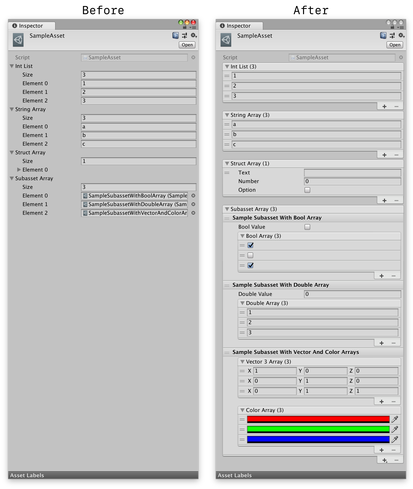

# UnityExtensions.ArrayDrawer



## Installation

### Option 1: Via Unity Package Manager

Add an entry to your project's `Packages/manifest.json` dependencies list using the package name "com.garettbass.unityextensions.arraydrawer"; e.g.:
```json
{
  "dependencies": {
    "com.garettbass.unityextensions.arraydrawer": "https://github.com/garettbass/UnityExtensions.ArrayDrawer.git"
  }
}
```

Alternatively, clone the project somewhere on your machine and add it as a [local package](https://docs.unity3d.com/Manual/upm-localpath.html).

### Option 2: Manually

Just clone this repo somewhere inside your Unity project's `Assets` or `Packages` folders.

## `ArrayDrawer`

To customize the editing experience for a member variable, you can implement a property drawer class that derives from the [UnityEditor.PropertyDrawer](https://docs.unity3d.com/ScriptReference/PropertyDrawer.html) base class.  However, when a property drawer is specified for an array or list, Unity associates that property drawer with the elements of the array or list, not the array or list itself.

I created the `UnityExtensions.ArrayDrawer` base class to enable the creation of property drawers that customize the editing experience for arrays and lists.  The provided `ReorderableListDrawer` derives from `ArrayDrawer` to do its business, but you can just as easily implement other sorts of array and list UI customizations.  For example, in one project where I use this library, I have implemented `EnumeratedArrayDrawer` which provides a named array element for each value of the provided `enum` type.

## `ReorderableListDrawer`

As an example `ArrayDrawer`-derived property drawer, this library provides `ReorderableListDrawer`, which presents an array or list using Unity's `ReorderableList` UI element, providing a much better default editing experience for arrays and lists.  Additionally, the `ReorderableListDrawer` supports the use case where the elements of an array should be subassets of the same Unity asset.  You can enable this feature by attaching the `ReorderableListAttribute` to the array or list in your `ScriptableObject`. The class shown in the screenshot above uses this feature for the `SampleAsset.subassetArray` member variable:

```cs

    public class SampleAsset : ScriptableObject
    {

        /* other fields ... */

        // show `subassetArray` elements directly in the inspector,
        // and save them to the same *.asset file
        [ReorderableList(elementsAreSubassets: true)]
        public SampleSubasset[] subassetArray;

    }

```

## `ReorderableListDrawerAttribute`

The `ReorderableListDrawerAttribute` can be attached to an array or list member variable to configure the behavior of the `ReorderableListDrawer`.  It provides the following configuration options:

* `bool disableAdding` - Disables the `+` button in the `ReorderableList` UI

* `bool disableRemoving` - Disables the `-` button in the `ReorderableList` UI

* `bool disableAddingAndRemoving` - A shortcut to diable both adding and removing

* `bool disableDragging` - Prevents the user from reordering array elements by drag & drop

* `bool elementsAreSubassets` - Directs the `ReorderableListDrawer` to embed array elements that derive from `ScriptableObject` into the same Unity `.asset` file that contains the array or list, and to also show their member variables in the array, instead of the default object picker UI normally shown for a `ScriptableObject`.  This is especially useful for arrays of polymorphic types, since Unity only supports polymorphism for classes that derive from `ScriptableObject`.

## `ReorderableListDrawerInjector`

This class attempts to attach the `ReorderableListDrawer` as the default property drawer for all arrays and lists for which no other property drawer is provided.  As a result, all of your arrays and lists that would normally receive the default UI treatment (seen on the left in the screenshot above) will instead receive the `ReorderableListDrawer` UI.
